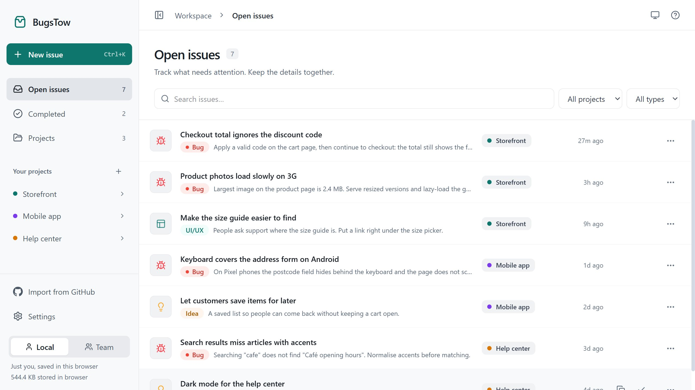
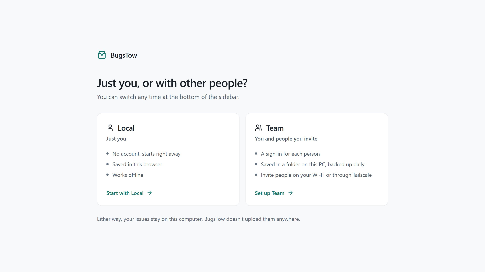
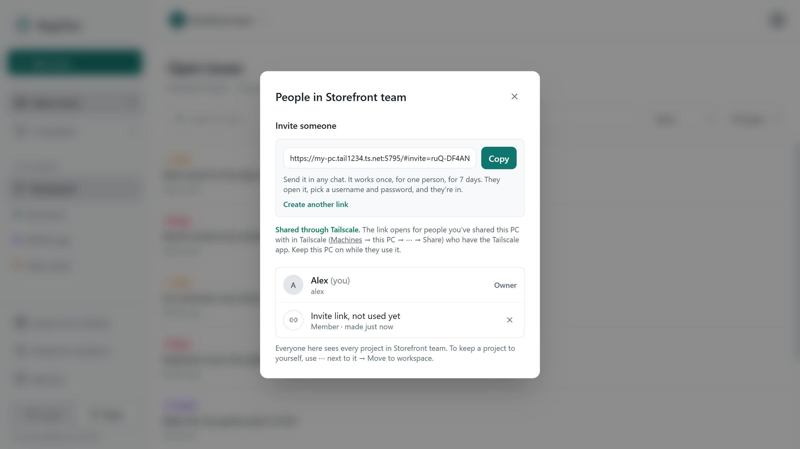
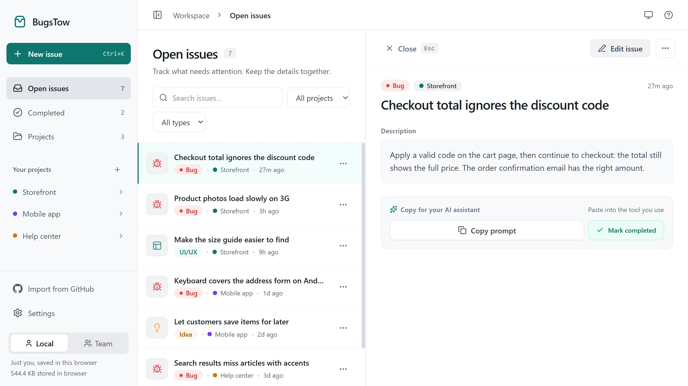

<div align="center">
  
  <h1>BugsTow</h1>
  <p><strong>Spot it. Stow it. Fix it.</strong></p>
  <p>A small issue tracker that runs on your own computer.<br />Use it alone, or invite a few people over your Wi-Fi or Tailscale.</p>
  <p>
    <a href="https://github.com/Gr33nOps/bugstow/releases/latest"></a>
    <a href="https://github.com/Gr33nOps/bugstow/actions/workflows/ci.yml"></a>
    <a href="LICENSE"></a>
  </p>
  <p><a href="#install">Install</a> · <a href="#local-or-team">Local or Team</a> · <a href="#invite-people">Invite people</a> · <a href="docs/INSTALL.md">Guide</a></p>
</div>

<picture>
  <source media="(prefers-color-scheme: dark)" srcset="docs/screenshots/workspace-dark.jpg" />
  
</picture>

Write down a bug the moment you see it, add a screenshot, and put it in a project. When you sit down to fix things, the list is waiting. Copy an issue as a prompt for your coding assistant, or pull in the issues from a GitHub repository.

BugsTow is free and open source. There is no account to create with us, no hosted service and no cloud storage: your issues stay on your computer.

## Install

**Windows** (PowerShell):

```powershell
irm https://raw.githubusercontent.com/Gr33nOps/bugstow/main/install.ps1 | iex
```

**macOS or Linux** (Terminal):

```sh
curl -fsSL https://raw.githubusercontent.com/Gr33nOps/bugstow/main/install.sh | sh
```

The installer brings its own copy of Node.js, checks every download against its checksum, adds a **BugsTow** shortcut and opens **http://localhost:5757**. It doesn't need administrator rights. Run the same command again to update; your issues are kept.

## Local or Team



|  | **Local** | **Team** |
| --- | --- | --- |
| For | Just you | You and people you invite |
| Issues are saved | In this browser | In BugsTow's folder on your computer, backed up daily |
| Sign-in | None | A username and password for each person |
| Others join | — | On your Wi-Fi, or from anywhere through Tailscale |

Switch any time with the **Local | Team** switch at the bottom of the sidebar. Switching never moves or deletes anything. When you start using Team, **Copy Local issues** brings your Local work along.

## Invite people



1. **Let them reach your computer.** Same Wi-Fi or office: run `bugstow start --lan`. Somewhere else: install [Tailscale](https://tailscale.com) (free) on your PC and theirs, run `bugstow share`, and share your PC with them in Tailscale.
2. **Send a link.** In Team, open **People & invitations** → **Create invite link** → **Copy**, and send it in any chat.
3. **They join.** They open the link, pick a username and password, and they're in. No email is needed or sent.

Each link works once, for one person, for 7 days. People you invite see every project in that workspace; to keep one to yourself, move it to a workspace only you are in (**⋯** next to the project → **Move to workspace**). Your computer needs to be on while they use BugsTow. [Step by step](docs/INSTALL.md#people-on-other-networks-bugstow-share).

## What you can do



- **Capture quickly.** Press <kbd>Ctrl</kbd>+<kbd>K</kbd>, give it a title, and paste or drop screenshots if they help.
- **Keep it organised.** Projects, bug / UI-UX / idea types, search, and a Completed list for finished work.
- **Hand it to your AI assistant.** **Copy prompt** turns an issue into a prompt you can paste into the tool you use; with a screenshot attached, it's **Copy with screenshot**.
- **Import from GitHub.** Paste a repository link. Importing again adds new issues and follows open/closed, without duplicates. BugsTow never changes anything on GitHub.
- **Work together.** Assign issues, keep several workspaces, and move a project between them.
- **Keep copies.** Team backs up daily, and can copy each backup to a second drive. Local can download a backup file, optionally encrypted.

Light and dark themes, keyboard shortcuts and phone-sized screens are supported.

## Your data

- Local issues live in your browser; Team data lives in a folder on the computer running BugsTow. Nothing is uploaded to BugsTow or to any cloud.
- After installation everything works offline. Only GitHub import and updates use the internet. [Details](docs/OFFLINE.md)
- BugsTow doesn't encrypt data at rest. Clearing browser data deletes Local issues, so keep a backup, and whoever runs a Team computer can read its data.

## Everyday commands

| Command | What it does |
| --- | --- |
| `bugstow` | Start BugsTow (if needed) and open it |
| `bugstow stop` · `bugstow status` | Stop it · see whether it's running and where the data is |
| `bugstow start --lan` | Let devices on your Wi-Fi connect |
| `bugstow share` · `bugstow unshare` | Let people elsewhere connect through Tailscale · stop |
| `bugstow reset-password <username>` | Set a temporary password for someone who forgot theirs |
| `bugstow uninstall` | Remove the app; your data folder is kept |

## Documentation

| | |
| --- | --- |
| [Install guide](docs/INSTALL.md) | Installing, updating, Wi-Fi and Tailscale, invites, backups, troubleshooting |
| [Team server with Docker](docs/SELF_HOSTING.md) | Running BugsTow on a dedicated server for a larger team |
| [Offline use](docs/OFFLINE.md) | What connects where, and how to check it yourself |
| [Changelog](CHANGELOG.md) | What changed in each version |
| [Security policy](SECURITY.md) | Reporting a vulnerability privately |
| [Contributing](CONTRIBUTING.md) | Development setup, tests and pull requests |

Found a bug or have an idea? [Open an issue](https://github.com/Gr33nOps/bugstow/issues/new/choose).

## Development

React, TypeScript, Vite and Tailwind CSS in the browser; Express, SQLite and better-auth on the server.

```sh
npm ci
npm run dev          # http://localhost:8443
npm test && npm run typecheck
```

The server, tests and pull-request workflow are described in [CONTRIBUTING.md](CONTRIBUTING.md).

## License

[MIT](LICENSE) · made by [Gr33nOps](https://github.com/Gr33nOps)
